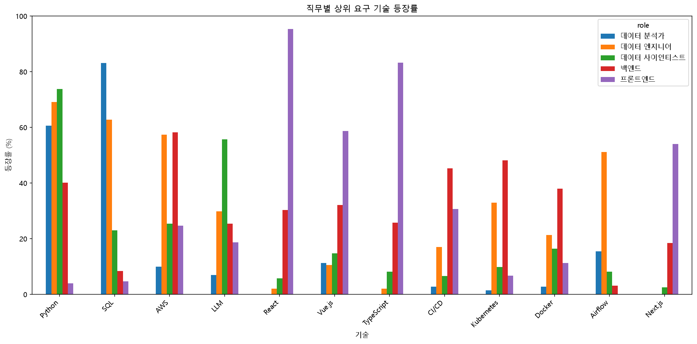
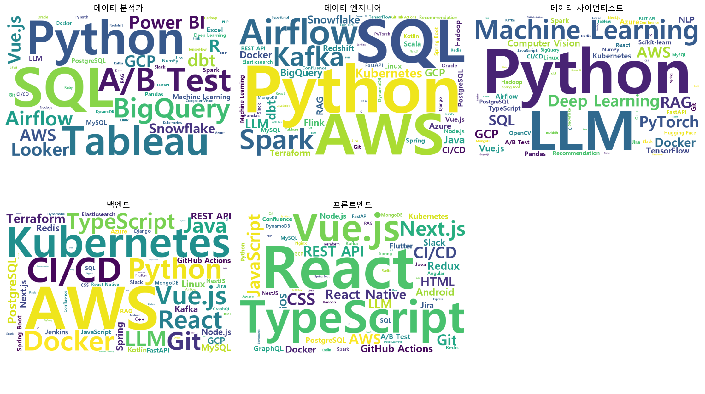
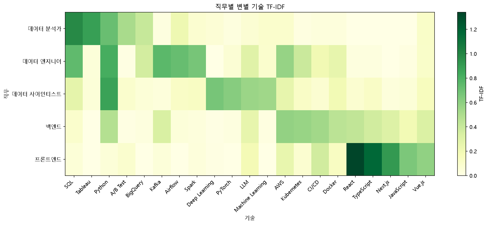
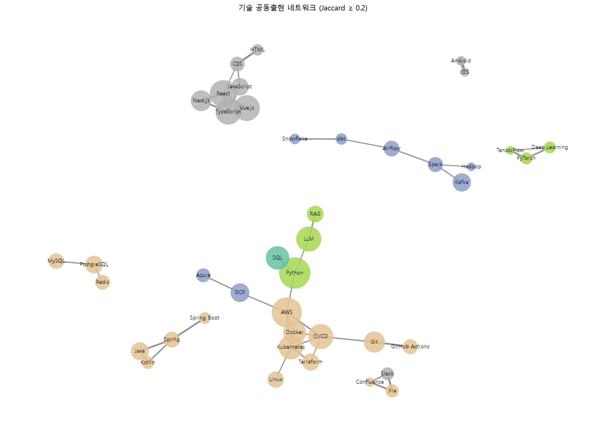
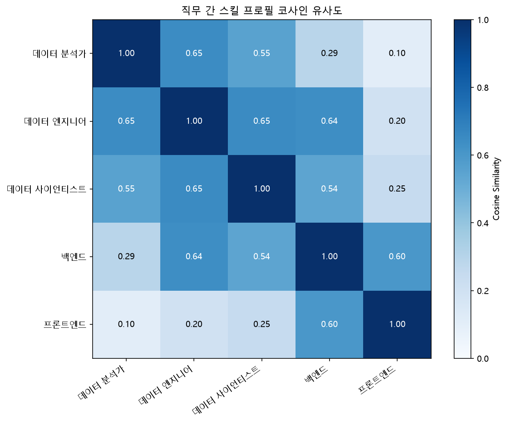

# 채용공고 기반 직무별 요구 기술 분석 보고서

## 1. 분석 목적

채용공고에 명시된 요구 기술을 분석하여 직무별로 어떤 기술이 중요하게 요구되는지 파악하고자 한다.

단순히 기술의 등장 빈도를 확인하는 데 그치지 않고, 직무별 핵심 기술과 차별화 기술, 함께 요구되는 기술 조합을 분석하여 직무 간 기술 요구의 차이를 확인한다.

이를 통해 취업 준비 과정에서 지원 직무에 적합한 기술을 선정하고, 학습 우선순위를 결정하는 데 활용할 수 있는 객관적인 근거를 마련하는 것이 목적이다.

---

## 2. 분석 데이터 및 방법

### 2.1 분석 데이터

- **데이터 출처:** 원티드(Wanted) 공개 API
- **수집 공고 수:** 1,273건
- **분석 대상:** 데이터 분석가, 데이터 엔지니어, 데이터 사이언티스트, 백엔드, 프론트엔드
- **최종 분석 공고 수:** 724건
- **스킬 사전:** 표준 기술명 90개, 별칭 210개

수집한 채용공고를 직무명 기준으로 재분류하고, 분석 대상인 5개 직무에 해당하는 공고를 선별하였다.

이후 채용공고의 텍스트에서 기술명을 추출하고, 공고별 기술 등장 여부를 0과 1로 표현한 스킬 매트릭스를 생성하여 분석에 활용하였다.

### 2.2 분석 방법

**1. 스킬 등장률 분석**

직무별 전체 공고 중 특정 기술이 등장한 공고의 비율을 계산하여 핵심 요구 기술을 파악하였다.

**2. TF-IDF 분석**

여러 직무에서 공통으로 요구되는 기술과 특정 직무에서 상대적으로 두드러지는 기술을 구분하기 위해 TF-IDF를 적용하였다.

**3. 공동출현 분석**

동일한 채용공고에 함께 등장하는 기술 쌍을 추출하고, 공동출현 횟수와 Jaccard 유사도를 계산하여 기술 간 연관성을 분석하였다.

**4. 추가 인사이트 분석**

LLM의 직무별 등장 현황, 경력 구간별 평균 요구 기술 수, 직무 간 기술 등장률 벡터의 코사인 유사도를 분석하였다.

---

## 3. 주요 분석 결과

### 3.1 직무별 핵심 기술 - 등장률 분석

직무별 채용공고에서 각 기술이 등장한 비율을 계산하여 주요 요구 기술을 비교하였다.

| 직무 | 주요 기술 1 | 주요 기술 2 | 주요 기술 3 |
|---|---|---|---|
| 데이터 분석가 | SQL (83%) | Python (61%) | Tableau (42%) |
| 데이터 엔지니어 | Python (69%) | SQL (63%) | AWS (57%) |
| 데이터 사이언티스트 | Python (74%) | LLM (56%) | Machine Learning (38%) |
| 백엔드 | AWS (58%) | Kubernetes (48%) | CI/CD (45%) |
| 프론트엔드 | React (95%) | TypeScript (83%) | Vue.js (59%) |

#### 직무별 주요 기술 등장률 시각화

위 그래프는 주요 기술의 등장률을 5개 직무별로 비교한 결과이다. 동일한 기술이라도 직무에 따라 요구되는 비율이 다르게 나타나는 것을 확인할 수 있다.

#### 직무별 기술 워드클라우드

워드클라우드는 직무별 주요 기술의 등장 빈도를 시각적으로 표현한 결과이다. 글자가 클수록 해당 직무의 채용공고에서 더 자주 등장한 기술을 의미한다.

#### 분석 결과

- **데이터 분석가:** Python보다 SQL의 등장률이 높아 데이터 조회 및 분석을 위한 SQL 역량이 중요하게 요구되는 것으로 나타났다.

- **데이터 엔지니어:** Python과 SQL뿐 아니라 AWS, Airflow, Spark 등 데이터 처리 및 인프라 관련 기술이 함께 요구되는 특징을 보였다.

- **데이터 사이언티스트:** Python을 중심으로 LLM, 머신러닝, 딥러닝 관련 기술이 두드러졌다.

- **백엔드:** AWS, Kubernetes, CI/CD 등 서버 운영 및 배포 환경과 관련된 기술의 등장률이 높았다.

- **프론트엔드:** React와 TypeScript의 등장률이 특히 높아 주요 기술 구성이 뚜렷하게 나타났다.

#### 시사점

직무별로 요구 기술의 종류와 등장 비율에 차이가 있으므로, 전체 기술의 인기도보다 지원하려는 직무의 기술 요구 패턴을 기준으로 학습 우선순위를 설정하는 것이 효과적일 수 있다.

---

### 3.2 직무를 구별하는 기술 - TF-IDF 분석

단순 등장률만으로는 특정 기술이 해당 직무를 얼마나 특징적으로 나타내는지 판단하기 어렵다.

예를 들어 Python은 여러 직무에서 공통으로 요구되기 때문에 등장률이 높더라도 특정 직무만의 차별화 기술이라고 보기 어렵다.

이를 보완하기 위해 TF-IDF를 적용하여 직무별 기술의 상대적인 중요도를 분석하였다.

#### 분석 방법

- **TF(Term Frequency):** 해당 직무의 채용공고에서 특정 기술이 등장한 비율
- **DF(Document Frequency):** 특정 기술의 등장률이 5% 이상인 직무의 수
- **IDF(Inverse Document Frequency):** 여러 직무에 공통으로 등장하는 기술의 가중치를 낮추는 값
- **TF-IDF:** TF와 IDF를 곱하여 특정 직무에서 상대적으로 두드러지는 기술을 파악하는 지표

이번 분석에서는 개별 채용공고가 아닌 직무를 비교 단위로 사용하였다.

#### 분석 결과

직무별 TF-IDF 값이 높은 상위 3개 기술은 다음과 같다.

| 직무 | 1위 | 2위 | 3위 |
|---|---|---|---|
| 데이터 분석가 | SQL (0.9825) | Tableau (0.8867) | Python (0.7161) |
| 데이터 엔지니어 | Python (0.8176) | Kafka (0.7565) | SQL (0.7421) |
| 데이터 사이언티스트 | Python (0.8722) | Deep Learning (0.6709) | PyTorch (0.6193) |
| 백엔드 | AWS (0.5819) | Kubernetes (0.5685) | CI/CD (0.5355) |
| 프론트엔드 | React (1.3399) | TypeScript (1.1712) | Next.js (0.9143) |

#### TF-IDF 히트맵

히트맵은 직무별 주요 기술의 TF-IDF 점수를 비교한 결과이다. 색이 진할수록 해당 직무에서 기술의 TF-IDF 점수가 높다는 의미이다.

- **데이터 분석가:** SQL과 Tableau가 높은 TF-IDF 값을 보여 데이터 조회 및 시각화 관련 기술이 두드러졌다.

- **데이터 엔지니어:** Python과 Kafka가 상위에 나타나 프로그래밍 및 데이터 처리 관련 기술의 특징을 확인할 수 있었다.

- **데이터 사이언티스트:** Python과 함께 Deep Learning, PyTorch가 상위에 나타나 머신러닝 모델 개발 관련 기술이 두드러졌다.

- **백엔드:** AWS, Kubernetes, CI/CD 등 인프라 및 배포 관련 기술이 높은 값을 보였다.

- **프론트엔드:** React, TypeScript, Next.js 등 웹 프론트엔드 개발 기술이 상위에 나타났다.

특히 Python은 여러 데이터 직무에서 높은 TF-IDF 값을 보였다. 이는 TF-IDF가 반드시 특정 직무에만 등장하는 기술을 의미하는 것은 아니며, 해당 직무에서의 등장률과 다른 직무에서의 분포를 함께 반영한다는 점을 보여준다.

또한 TF-IDF 값은 등장률 자체가 아닌 가중치가 적용된 지표이므로, 값이 1을 초과할 수 있다.

#### 시사점

직무별 기술 학습 전략을 수립할 때는 등장률이 높은 핵심 기술과 TF-IDF 값이 높은 차별화 기술을 함께 고려할 필요가 있다.

---

### 3.3 함께 요구되는 기술 - 공동출현 분석

채용공고에서 개별 기술의 등장 빈도뿐 아니라, 동일한 공고에 함께 등장하는 기술 조합을 파악하기 위해 공동출현 분석을 수행하였다.

단순 공동출현 횟수는 등장 빈도가 높은 기술에 유리하므로, 이를 보완하기 위해 Jaccard 유사도를 함께 계산하였다.

#### 분석 방법

- **공동출현 횟수:** 두 기술이 동일한 채용공고에 함께 등장한 횟수
- **Jaccard 유사도:** 두 기술 중 하나라도 등장한 공고 대비 두 기술이 함께 등장한 공고의 비율
- **분석 대상:** 전체 분석 공고에서 20건 이상 등장한 기술

Jaccard 유사도는 0에서 1 사이의 값을 가지며, 값이 높을수록 두 기술이 같은 공고에 함께 등장하는 비율이 높다는 의미이다.

#### 분석 결과

공동출현 횟수가 높은 기술 조합은 다음과 같다.

| 기술 조합 | 공동출현 횟수 | Jaccard 유사도 |
|---|---:|---:|
| TypeScript + React | 184건 | 0.692 |
| Python + AWS | 149건 | 0.320 |
| AWS + CI/CD | 135건 | 0.372 |
| React + Next.js | 128건 | 0.516 |
| Python + SQL | 128건 | 0.348 |

#### 기술 공동출현 네트워크

네트워크 그래프는 Jaccard 유사도가 0.2 이상인 기술 조합을 시각화한 결과이다. 노드는 개별 기술을, 연결선은 기술 간 공동출현 관계를 나타낸다.

TypeScript와 React는 공동출현 횟수와 Jaccard 유사도가 모두 높아 밀접하게 함께 요구되는 기술 조합으로 나타났다.

반면 Python과 AWS는 공동출현 횟수가 많지만 Jaccard 유사도는 상대적으로 낮았다. 이는 두 기술이 각각 다양한 공고에서 폭넓게 등장하기 때문일 수 있다.

또한 Android와 iOS는 공동출현 횟수가 22건이지만 Jaccard 유사도가 0.815로 높게 나타났다. 이는 기술 조합의 밀접성을 판단할 때 단순 등장 횟수뿐 아니라 Jaccard 유사도를 함께 고려해야 함을 보여준다.

다만 공동출현 횟수가 적은 기술 조합은 상대적으로 적은 표본에 영향을 받을 수 있으므로, 유사도와 등장 횟수를 함께 해석해야 한다.

#### 시사점

채용공고에서는 기술이 개별적으로 요구되기보다 특정 기술 조합으로 등장하는 경우가 있다.

따라서 취업 준비 과정에서 기술을 하나씩 독립적으로 학습하는 것뿐 아니라, 지원 직무에서 함께 요구되는 기술을 묶어 학습하는 전략도 고려할 수 있다.

---

### 3.4 LLM 요구 현황 분석

최근 AI 관련 기술 중 하나인 LLM이 분석 대상 직무에서 얼마나 요구되는지 확인하였다.

#### 분석 결과

전체 분석 공고 724건 중 LLM이 등장한 공고는 202건이었다.

| 직무 | LLM 등장 공고 수 |
|---|---:|
| 데이터 분석가 | 5건 |
| 데이터 엔지니어 | 28건 |
| 데이터 사이언티스트 | 68건 |
| 백엔드 | 73건 |
| 프론트엔드 | 28건 |
| **합계** | **202건** |

데이터 사이언티스트는 전체 122건 중 약 56%에서 LLM이 등장하여 분석 직무 중 가장 높은 등장률을 보였다.

반면 LLM이 등장한 공고 수 자체는 백엔드가 73건으로 가장 많았다.

이는 LLM 관련 기술이 데이터 사이언티스트뿐 아니라 백엔드 등 다른 개발 직무의 채용공고에서도 요구되고 있음을 보여준다.

#### 시사점

LLM 관련 역량을 준비할 때는 AI 모델 자체에 대한 이해뿐 아니라, 지원 직무에서 LLM을 어떤 방식으로 활용하는지 확인할 필요가 있다.

---

### 3.5 경력별 요구 기술 수 분석

경력 수준에 따라 채용공고에서 요구하는 기술의 개수가 달라지는지 분석하였다.

#### 분석 결과

| 경력 구간 | 공고 수 | 평균 요구 기술 수 | 중앙값 |
|---|---:|---:|---:|
| 0~1년 | 144건 | 7.0개 | 6개 |
| 2~4년 | 297건 | 7.5개 | 7개 |
| 5년 이상 | 277건 | 7.7개 | 7개 |
| 경력 미상 | 6건 | 7.5개 | 8개 |

경력 수준이 높아질수록 평균 요구 기술 수는 소폭 증가하였다.

그러나 0~1년과 5년 이상 구간의 평균 차이는 약 0.7개로, 경력 수준에 따라 요구 기술 수가 크게 달라지는 패턴은 확인되지 않았다.

다만 요구 기술의 개수만으로 실제 기술 숙련도나 업무 난이도를 판단할 수는 없다.

#### 시사점

경력에 따른 채용 요구를 이해할 때는 단순히 기술의 개수뿐 아니라, 기술별 요구 숙련도와 실제 담당 업무를 함께 살펴볼 필요가 있다.

---

### 3.6 직무 간 기술 요구 패턴 유사도 분석

서로 다른 직무에서 요구하는 기술 구성이 얼마나 유사한지 확인하기 위해 직무별 기술 등장률 벡터의 코사인 유사도를 계산하였다.

#### 분석 방법

각 직무에서 기술별 등장률을 벡터로 구성한 뒤, 두 직무 벡터 사이의 코사인 유사도를 계산하였다.

코사인 유사도는 두 벡터의 방향이 얼마나 유사한지를 나타내며, 이번 분석에서는 값이 1에 가까울수록 두 직무의 기술 요구 패턴이 유사하다고 해석하였다.

#### 직무 간 코사인 유사도 히트맵

#### 분석 결과

데이터 엔지니어는 다음 직무와 비교적 높은 유사도를 보였다.

- 데이터 분석가: 0.65
- 데이터 사이언티스트: 0.65
- 백엔드: 0.64

또한 백엔드와 프론트엔드의 유사도는 0.60으로 나타났다.

반면 데이터 분석가와 프론트엔드의 유사도는 0.10으로 상대적으로 낮았다.

이는 데이터 엔지니어가 데이터 분석, 데이터 사이언스 및 백엔드와 일부 기술 요구 패턴을 공유하는 반면, 데이터 분석가와 프론트엔드는 기술 구성이 상대적으로 다르다는 점을 보여준다.

#### 시사점

직무 간 기술 요구 패턴의 유사도를 확인하면 인접 직무로의 역량 확장 가능성을 탐색하거나, 여러 직무에서 공통으로 요구되는 기술을 파악하는 데 참고할 수 있다.

다만 코사인 유사도가 높다고 해서 실제 업무 내용이나 직무 전환 난이도까지 동일하다는 의미는 아니다.

---

## 4. 종합 결론

본 프로젝트에서는 원티드 채용공고 1,273건을 수집하고, 이 중 5개 직무로 분류된 724건을 대상으로 요구 기술을 분석하였다.

스킬 등장률 분석을 통해 직무별 주요 요구 기술의 차이를 확인하였으며, TF-IDF 분석을 통해 특정 직무에서 상대적으로 두드러지는 기술을 파악하였다.

또한 공동출현 분석과 Jaccard 유사도를 활용하여 함께 요구되는 기술 조합을 확인하고, LLM 요구 현황, 경력별 기술 수, 직무 간 코사인 유사도를 추가로 분석하였다.

### 주요 결론

1. **직무별 기술 요구의 차이:** 동일한 IT 분야에서도 직무에 따라 핵심적으로 요구되는 기술이 다르게 나타났다.

2. **기술의 등장률과 차별성:** 자주 등장하는 기술이 반드시 특정 직무만의 특징적인 기술을 의미하지는 않으므로, 등장률과 TF-IDF를 함께 고려할 필요가 있다.

3. **기술 조합의 중요성:** 채용공고에서 여러 기술이 함께 요구되는 패턴을 확인하였으며, 기술 스택 단위의 학습 전략이 유용할 수 있음을 확인하였다.

4. **LLM 요구의 확장:** LLM 관련 기술은 데이터 사이언티스트뿐 아니라 백엔드 등 다양한 개발 직무의 채용공고에서도 등장하였다.

5. **경력별 기술 수의 차이:** 경력 구간별 평균 요구 기술 수에는 소폭의 차이가 있었지만, 기술의 개수만으로 요구 역량의 수준을 판단하기는 어려웠다.

6. **직무 간 기술 요구의 유사성:** 데이터 엔지니어는 데이터 분석가, 데이터 사이언티스트, 백엔드와 비교적 유사한 기술 요구 패턴을 보였다.

이러한 분석 결과는 취업 준비자가 지원 직무에 필요한 기술을 파악하고 학습 우선순위를 설정하는 데 참고 자료로 활용할 수 있다.

### 분석의 한계

본 분석은 원티드라는 단일 플랫폼에서 수집한 채용공고를 기반으로 하므로 전체 채용시장의 요구 기술을 대표한다고 보기는 어렵다.

또한 스킬 사전에 등록된 기술의 텍스트 등장 여부를 분석하였으므로, 사전에 포함되지 않은 기술이나 문맥에 따른 의미 차이를 완전히 반영하기 어렵다.

직무별 분석 공고 수에도 차이가 있으며, 제목 기반 재분류 과정에서 분류가 모호한 공고는 제외되었다.

따라서 본 분석 결과는 채용공고에 나타난 기술 요구의 패턴을 보여주는 참고 자료이며, 기술의 실제 숙련도나 채용 성공에 미치는 인과적 영향을 직접적으로 설명하지는 않는다.
